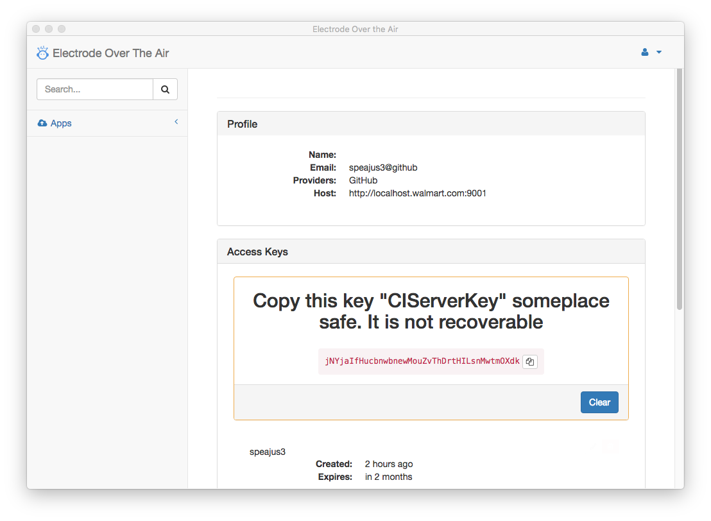

Electrode OTA Desktop
===
A GUI for the code-push command line.

Download the latest [here](releases)





###Development
The Electrode OTA Desktop is an electron app. Most of the UI code is in [electrode-ota-ui](../electrode-ota-ui). Due
to various technical and time constraints both need to be installed for this to work correctly.   They have not been publicly
published yet so bear with the nuttyness.

First you need node/npm install >6.5.0 [node](https://nodejs.org/en/) from https://nodejs.org/en/
 
```sh
$ mkdir electrode-ota
$ cd electrode-ota
$ git clone https://github.com/electrode-io/electrode-ota-ui
$ git clone https://github.com/electrode-io/electrode-ota-desktop
$ cd electrode-ota-ui
$ npm install
$ npm run electron
$ cd ../electrode-ota-desktop
$ npm install
$ npm run distro
$ #To test the app
$ open dist/mac/ElectrodeOTA.app
$ #To test the dmg
$ open dist/mac/ElectrodeOTA-{version}.dmg
```
### To debug/develop
To develop, it runs a webpack-dev-server in the background, for hmr.   However app/browser/main is not webpacked or
transpiled, its plain old javascript.  But all the ui is there under ../electrode-ota-ui so have fun, and send PR's.

```sh
$ npm run hot
```

This project uses [electron-builder](https://github.com/electron-userland/electron-builder) to buid the dmg and .app.
To add an app signature there are some tools [see](https://github.com/electron-userland/electron-osx-sign/wiki/1.-Getting-Started)
and for more [details](https://github.com/electron-userland/electron-builder/wiki/Options)
